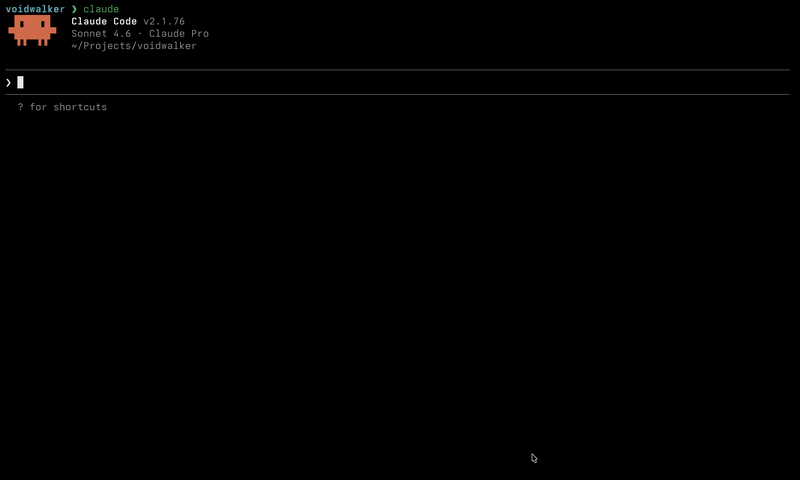

<div align="center">


# Voidwalker

**Let AI debug your browser state.**

[Issues](https://github.com/mohi-devhub/voidwalker/issues) · [Contributing](CONTRIBUTING.md) · [Changelog](CHANGELOG.md)



   [](https://chromewebstore.google.com/detail/kdcfieaegcbifeiondmgdjkimohkfill?utm_source=item-share-cb)  

</div>

---

Voidwalker is a browser extension + local MCP server that gives AI agents real-time access to your browser's storage state — localStorage, sessionStorage, IndexedDB, cookies, DOM mutations, and mutation history. The AI can read, search, diff, decode, and write browser storage while you work. No DevTools required.

It is a **drop-in MCP server** for Claude Desktop, Claude Code, Cursor, or any MCP-compatible client — point it at the binary and it just works.

## How it works

```
Browser Tab
    │
    ▼
Content Script  (MAIN world — intercepts storage APIs)
    │  window.postMessage
    ▼
Content Script  (ISOLATED world — relays to background)
    │  chrome.runtime.sendMessage
    ▼
Background Worker / Event Page
    │  WebSocket  ws://127.0.0.1:3695
    ▼
MCP Server  (Node.js — token-authenticated)
    │  stdio transport        │  SSE transport
    ▼                         ▼
Claude Desktop / Code      Cursor / Gemini CLI
```

All data stays on your machine. The server binds exclusively to `127.0.0.1`.

## What the AI can do

Ask your agent natural language questions — it picks the right tool automatically.

> *"Why is the login broken on this tab?"*
> *"What changed in localStorage in the last 30 seconds?"*
> *"Find all feature flags stored in this app."*
> *"Decode the JWT in the `authToken` key."*
> *"What storage mutations happened between my two page loads?"*

## Key Features

- **Storage history** — every `set`, `remove`, and `clear` is recorded in a per-origin changelog (last 1,000 mutations). Ask the AI what changed and when.
- **Automatic redaction** — values matching sensitive key patterns (`token`, `auth`, `session`, `jwt`, `password`, `secret`, etc.) are replaced with `[REDACTED]` in all read outputs. Use `decode_storage_value` to explicitly read a specific key.
- **Activity log** — every tool call is appended to `~/.voidwalker/activity.log`. You can always audit exactly what the AI read or wrote.
- **Write access** — the AI can set/delete localStorage, sessionStorage, and IndexedDB records, and navigate tabs. All writes are validated (origin checks, URL scheme enforcement).
- **Chrome + Firefox** — MV3 service worker for Chrome, MV2 event page for Firefox.
- **Zero external dependencies** — no cloud, no telemetry, no API keys beyond your AI client.

> [!WARNING]
> Voidwalker is under active development. You may run into bugs, rough edges, or breaking changes along the way.

---

## Installation

**1. Clone and build**

```bash
git clone https://github.com/mohi-devhub/voidwalker
cd voidwalker
npm install
npm run build
```

**2. Load the browser extension**

*Chrome:*

Install from the [Chrome Web Store](https://chromewebstore.google.com/detail/kdcfieaegcbifeiondmgdjkimohkfill?utm_source=item-share-cb).

Or load manually:
1. Open `chrome://extensions`
2. Enable **Developer mode** (top right)
3. Click **Load unpacked** → select `packages/extension/dist/`

*Firefox:*
1. Open `about:debugging#/runtime/this-firefox`
2. Click **Load Temporary Add-on** → select `packages/extension/dist-firefox/manifest.json`

**3. Start the MCP server**

```bash
npm install -g voidwalker-mcp
voidwalker-mcp
```

On first run, a 256-bit auth token is generated at `~/.voidwalker/token` (mode `0600`).

**4. Authenticate the extension**

Click the Voidwalker toolbar icon, paste the token from `~/.voidwalker/token`, and click **Save**. The status dot turns green when connected.

---

## Connect your AI client

### Claude Desktop

Add to `~/Library/Application Support/Claude/claude_desktop_config.json`:

```json
{
  "mcpServers": {
    "voidwalker": {
      "command": "voidwalker-mcp"
    }
  }
}
```

### Claude Code

```bash
claude mcp add voidwalker voidwalker-mcp
```

### Cursor / SSE clients

Start the server, then connect via SSE at `http://127.0.0.1:3695/sse?token=<your-token>`.

---

## MCP Tools

| Tool | Type | Description |
|------|------|-------------|
| `read_storage` | read | Read localStorage or sessionStorage — sensitive keys redacted |
| `query_indexeddb` | read | Query an IndexedDB object store |
| `get_cookie` | read | Get a specific cookie — sensitive names redacted |
| `search_cookies` | read | Search cookies by name or value pattern |
| `search_storage` | read | Search localStorage/sessionStorage by key or value pattern |
| `search_indexeddb` | read | Search IndexedDB records by value pattern across stores |
| `decode_storage_value` | read | Decode a value as JSON, base64, or JWT — full value, no redaction |
| `diff_storage` | read | Compare current storage against a baseline snapshot |
| `get_storage_history` | read | Mutation history for an origin — what changed and when |
| `get_dom_mutations` | read | Recent DOM mutations for a tab or origin |
| `set_storage` | write | Write a key to localStorage or sessionStorage |
| `delete_storage` | write | Delete a key from localStorage or sessionStorage |
| `delete_indexeddb` | write | Delete a record from an IndexedDB object store |
| `navigate_tab` | write | Navigate a tab to a URL (http/https only) |
| `request_snapshot` | admin | Ask the extension to re-send a full storage snapshot |
| `clear_server_state` | admin | Clear in-memory state for a tab, origin, or everything |

## MCP Resources

Resources are exposed as `browser://` URIs and update in real time as the page mutates storage.

| Resource | Description |
|----------|-------------|
| `browser://tabs` | All active tabs with metadata |
| `browser://tabs/{tabId}/origins/{origin}/localstorage` | localStorage entries |
| `browser://tabs/{tabId}/origins/{origin}/sessionstorage` | sessionStorage entries |
| `browser://tabs/{tabId}/origins/{origin}/indexeddb` | IndexedDB databases and records |
| `browser://tabs/{tabId}/origins/{origin}/cookies` | Cookies |
| `browser://tabs/{tabId}/origins/{origin}/events` | DOM mutation events for an origin |
| `browser://tabs/{tabId}/events` | All events for a tab |
| `browser://events/global` | All events across all tabs |

---

## Security

Voidwalker handles auth tokens, session cookies, and API keys. The security model is designed so you never have to trust it blindly.

- **Local-only networking** — the server binds to `127.0.0.1`. Nothing is reachable from outside your machine.
- **Token authentication** — both the WebSocket and SSE endpoint require a token from `~/.voidwalker/token`. The token is 256-bit random, stored at mode `0600`.
- **Automatic redaction** — values whose key names match sensitive patterns (`token`, `auth`, `session`, `jwt`, `password`, `secret`, `apikey`, `credential`, etc.) are replaced with `[REDACTED]` in all read outputs. Use `decode_storage_value` when you explicitly need the raw value.
- **Activity log** — every tool call is appended to `~/.voidwalker/activity.log` with its timestamp, action type, and arguments.
- **Origin verification** — storage write commands sent from the MCP server are validated against the tab's actual origin before execution.
- **URL scheme enforcement** — `navigate_tab` only accepts `http://` and `https://` URLs.
- **postMessage scoping** — MAIN world ↔ ISOLATED world messaging is scoped to the page's own origin.
- **WebSocket payload cap** — incoming messages are capped at 5 MB to prevent memory exhaustion.
- **Domain allowlist** — restrict AI access to specific origins via the extension popup. Empty = allow all; add origins to lock down which sites the AI can read or write.
- **Write confirmation** — enable "Confirm writes" in the popup to require Allow/Deny approval for every write operation before it executes.

---

## Environment variables

| Variable | Default | Description |
|----------|---------|-------------|
| `VOIDWALKER_PORT` | `3695` | WebSocket + HTTP port |

---

## Development

```bash
npm run dev:server      # MCP server with tsx watch
npm run dev:extension   # Chrome extension with Vite HMR
npm test                # Run all tests (vitest)
```

Build the Firefox extension:

```bash
npm run build:firefox --workspace=packages/extension
```

---

## Coming soon

- **Storage key allowlist** — opt-in specific keys so `authToken` is never exposed unless explicitly allowed
- **Snapshot & restore** — one-command bug reproduction: `snapshot_browser_state()` / `restore_snapshot(id)`
- **`analyze_page_state`** — AI explains why a page is broken based on cross-storage inconsistencies
- **Panic button** — single-click toggle to instantly disconnect all AI access
- **Console capture** — stream `console.error`, `console.warn`, and unhandled JS exceptions to the AI in real time
- **Network interception** — intercept `fetch` and `XMLHttpRequest` calls so the AI can inspect request/response payloads, headers, and status codes without opening DevTools
- **Performance timeline** — expose `window.performance` entries so the AI can diagnose slow page loads and long tasks

---

## Contributing

Contributions are welcome. See [CONTRIBUTING.md](CONTRIBUTING.md) for setup instructions and areas that need help.

---

## License

[MIT](LICENSE)
